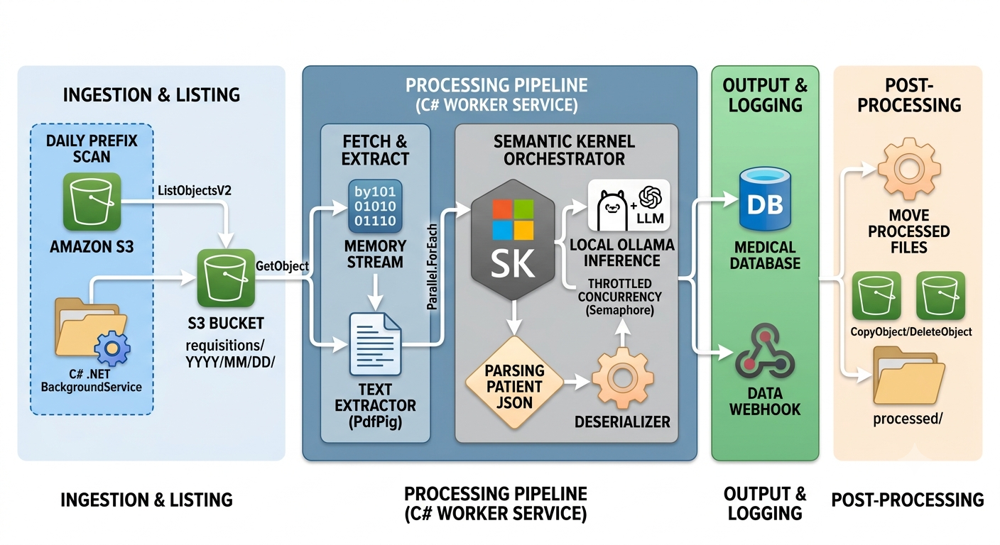
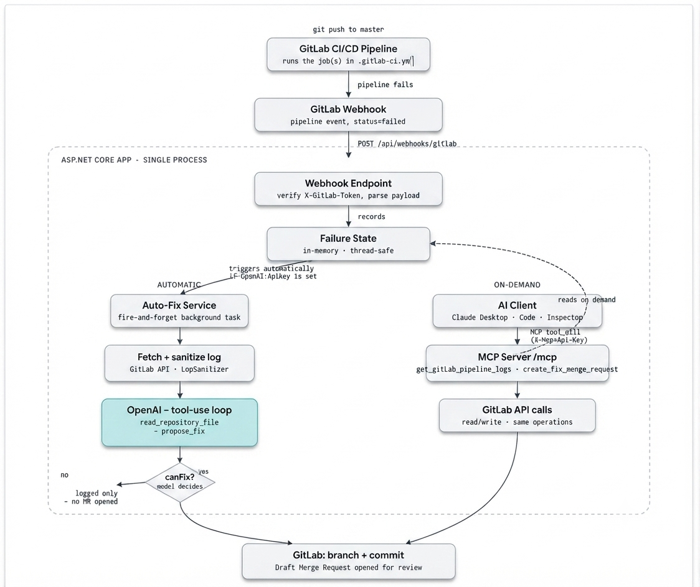
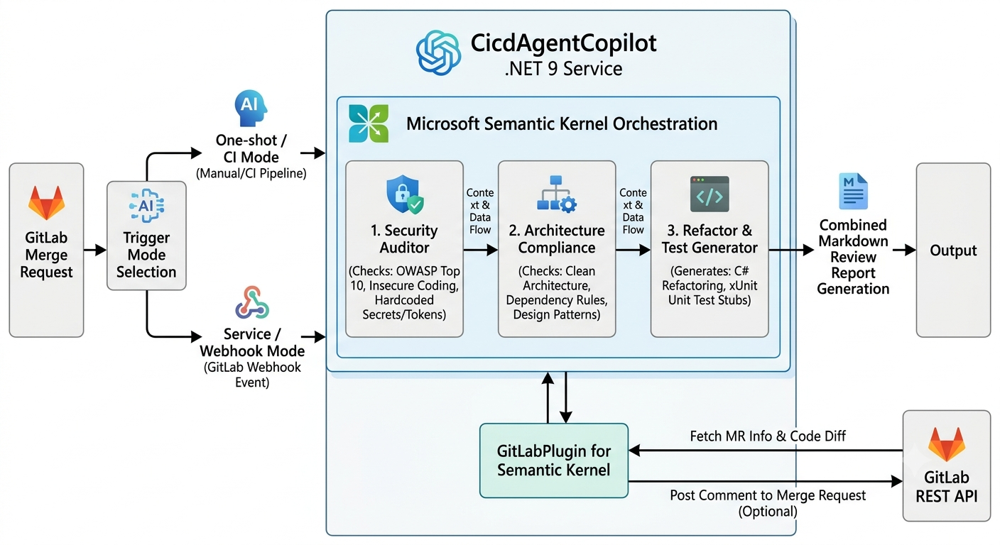
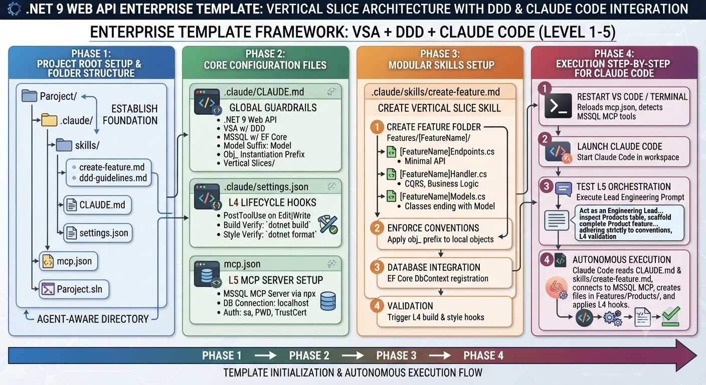

# Agentic-AI-Architecture-Orchestration
Enterprise-grade patterns, reference implementations, and architectural blueprints for building multi-agent AI systems, autonomous workflows, and LLM orchestration layers.

---

## 🏗️ Architectural Workflows

### 1. RCM AutoCoding Worker
A .NET 8 background worker service that automatically converts daily lab requisition PDFs from
Amazon S3 into structured, billable medical data. It streams each PDF in memory, extracts text with
PdfPig, falls back to Tesseract OCR for scanned/image-only pages, and prompts a locally-hosted LLM
(Ollama / Llama 3.1) via Semantic Kernel to emit a strict JSON record — patient identity, date of
service, specimen type, and CPT / ICD-10 codes. Processing is idempotent: successful documents are
moved to a processed/ prefix so restarts never reprocess. The model runs entirely on local
infrastructure, so protected health information never leaves the network.

**Stack:** C# · .NET 8 Worker Service · AWS S3 (AWSSDK.S3 v4) · PdfPig + Skia · Tesseract OCR · Semantic Kernel · Ollama (Llama 3.1)

**Process Flow:**

---

### 2. GitLab Pipeline Auto-Fix
An ASP.NET Core (.NET 8) service that automatically diagnoses and fixes failed GitLab CI/CD
pipelines using an OpenAI-powered agent. On failure, it fetches and sanitizes the real job log,
investigates using a tool-use agent that can read repository files, and — if it finds a safe,
single-file fix — opens a Draft Merge Request in GitLab for human review (never an auto-merge).
It also exposes an MCP (Model Context Protocol) server, so AI clients like Claude Desktop or
Claude Code can query the same failure data and trigger fixes on demand.

**Stack:** C# · ASP.NET Core (.NET 8) · OpenAI API (function calling) · ModelContextProtocol.AspNetCore · GitLab REST API v4

**Process Flow:**

---

### 3. Automated Multi-Agent Code Reviewer
An intelligent .NET 9 background/service application that automates code reviews and architectural audits for GitLab merge requests using multi-agent Microsoft Semantic Kernel orchestration. It fetches merge request details and code diffs via the GitLab REST API, then routes the code through a sequential multi-agent pipeline: a Security Auditor for vulnerability and secret detection (OWASP Top 10), an Architecture Compliance checker for Clean Architecture and design patterns, and a Refactor & Test Generator to produce C# refactoring recommendations and xUnit unit test stubs. The orchestration compiles everything into a comprehensive Markdown review report, with optional automated comment posting back to the GitLab merge request.

**Stack:** C# · .NET 9 · Microsoft Semantic Kernel · GitLab REST API · xUnit

**Process Flow:**

---

### 4. Claude Code Level 1–5 Integration & .NET 9 Enterprise Architecture Workflow
The architectural workflow outlines the sequential steps to set up and execute an enterprise-grade .NET 9 Web API template leveraging Vertical Slice Architecture, Domain-Driven Design, and Claude Code integration. It begins with Phase 1 by establishing the project root structure and agent-aware directory layout, followed by Phase 2 which configures global guardrails, lifecycle validation hooks, and database connectivity. Phase 3 introduces modular skill guides to automate feature scaffolding and adherence to naming conventions, while Phase 4 details the runtime execution process for launching Claude Code, running orchestration prompts, and performing automated, validated feature generation.

**Process Flow:**

